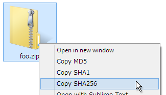

# hashfile-contextmenu

Add commands to get a hash string of a file to context menu of Windows Explorer.  
The hash string is used as checksum. It is saved to a clip board.

Hash Algorithm: MD5, SHA1 and SHA256

## Install

Open `hashfile-contextmenu-add.reg` file.  
Or `hashfile-contextmenu-add-MD5.reg` file to add a command to get MD5 only. `hashfile-contextmenu-add-SHA1.reg` and `hashfile-contextmenu-add-SHA256.reg` also.

## Uninstall

Open `hashfile-contextmenu-remove.reg` file.
